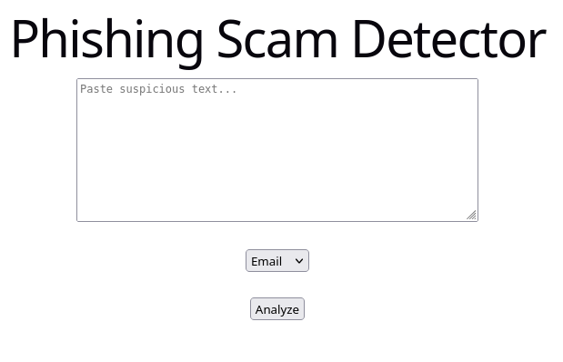
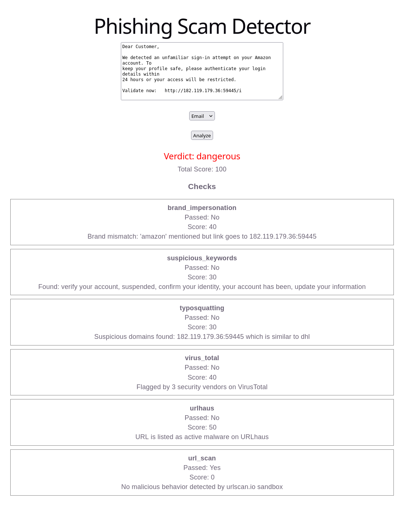
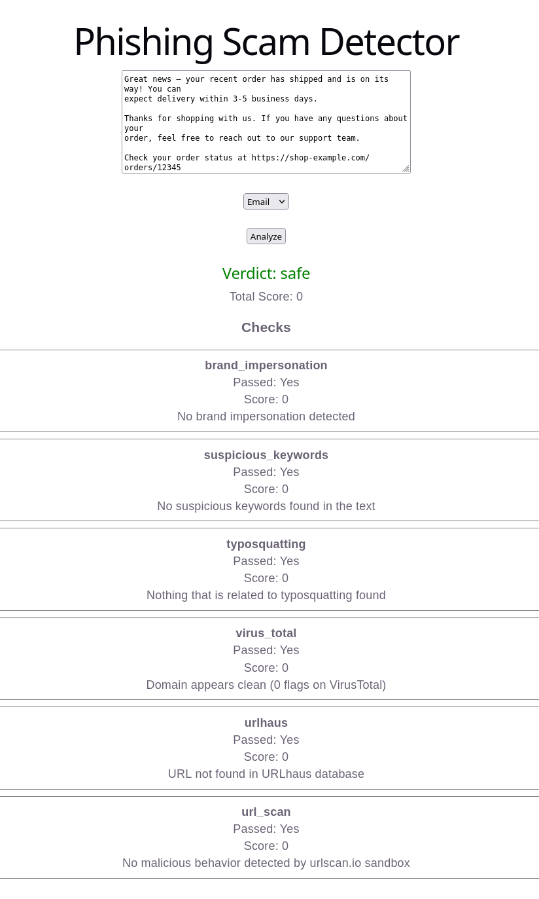
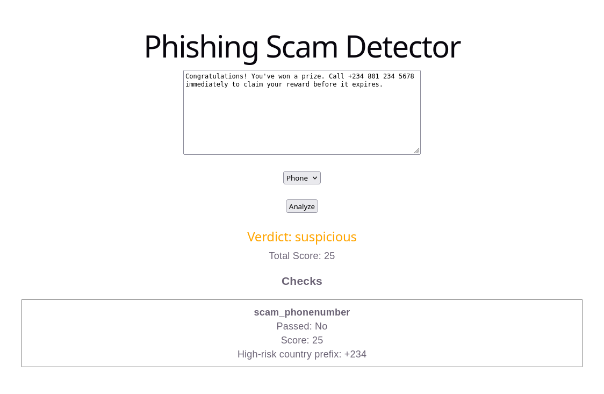

# Antiphish Detector

A web app that scans emails or phones for phishing and scamming content.


## Screenshots

### Main Page


### Dangerous - Phishing mail with malicious IP
- Note: The used IP is already flagged from URLhaus, don't use it.


### Safe - Legitimate mail


### Dangerous - Scam phone number



## Features

- Input Type: email or phone
- Runs static and external APIs checks
- From the scan returns score, verdict and per check breakdown


## Tech Stack

**Frontend:** React

**Backend:** FastAPI, httpx, pydantic, asyncio

**External-APIs:** VirusTotal, URLhaus, urlscan.io

**Fuzzy Matching:** Levenshtein


## Project Structure

backend/

- main.py
- models.py
- analyzer.py
- checkings/
    - static_rules.py
    - external_apis.py
    - keywords_synonyms.py

frontend/

- App.jsx

## Getting Started

### Prerequisites

- Python 3.12
- Node.js + Vite -> React.js
- API keys for VirusTotal, URLhaus and urlscan.io


### Environment Variables

To run this project three environment variables are needed cause of the external API calls that are made to VirusTotal, URLhaus and urlscan.io.

- VirusTotal: `VIRUS_API_KEY`
- URLhaus: `URL_HAUS_KEY`
- urlscan.io: `URL_SCAN_KEY`


## Installation
Clone the repository
```bash
git clone https://github.com/panven-ops/Antiphish.git
cd Antiphish
```

### Run Locally

Start the backend

```bash
  cd backend
  source venv/bin/activate
  pip install -r requirements.txt

  uvicorn main:app --reload
```

Start the frontend

```bash
cd frontend
npm install
npm run dev
```

## API Reference

#### Request body

```http
  POST /analyze
```

| Parameter | Type     | Description                |
| :-------- | :------- | :------------------------- |
| `text` | `string` | `text for analysis` |
| `input_type` | `input_type` | `email or phone` |

#### Response


| Parameter | Type     | Description                       |
| :-------- | :------- | :-------------------------------- |
| `verdict`      | `string` | `safe - suspicious - dangerous` |
| `total_score`| `integer`| `cumulative score in accordance to risk`|
| `checks`| `list`| `name(if problem) - passed(yes - no) - score(threat -> score) - detail`|


## How it works

### Static checks
It scans the text in accordance to the input_type.
- email: Scans for typosquatting, brand-impersonation - specific keywords.
    - typosquatting: in most phising attacks, attackers change from the original letter or two.
    - brand-impersonation: attackers impersonating famous brands.
    - suspicious keywords: attackers use words like "urgent", "suspended", "act now" etc.

- phone: suspicious phone - prefixes.
    - phone-prefixes: commonly phishing phones are with prefixes like "+92" or "+66" from countries like Pakistan or Thailand, countries -> scam hubs


### External API calls
Scans the text with the help of external tools VirusTotal and URLhaus.
- VirusTotal: checks if the domain has been flagged by security vendors.

- URLhaus: checks if the scanned URL is being listed as active malware.

- urlscan.io: submits the URL to a live sandbox and polls for a verdict based on rendered page behavior.
Note: since it analyzes webpage rendering, it may not flag threats served as raw file downloads (e.g. malware binaries hosted directly on an IP).

All three run in parallel using asyncio for quicker results and more efficiency.

### Scoring
- Each potential threat has a score. 
- Total score is being generated from all the potential threats a text possesses.
- Verdict is given in the end of the scan, where:

    - safe: total_score <= 20
    - suspicious: 20 < total_score <= 50
    - dangerous: total_score > 50

## Known Limitations
- Fuzzy keyword matching improves recall on paraphrased phishing language but is not exhaustive; some paraphrases with no lexical or synonym overlap with known keywords can still be missed.
- urlscan.io evaluates rendered page behavior and may not catch threats that don't involve a rendered webpage (e.g. direct file/malware downloads).

## License

[MIT](https://choosealicense.com/licenses/mit/)

